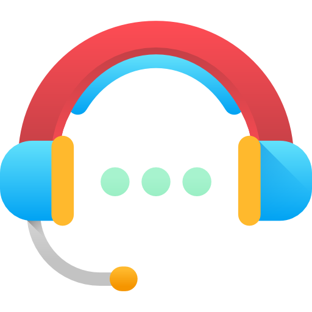
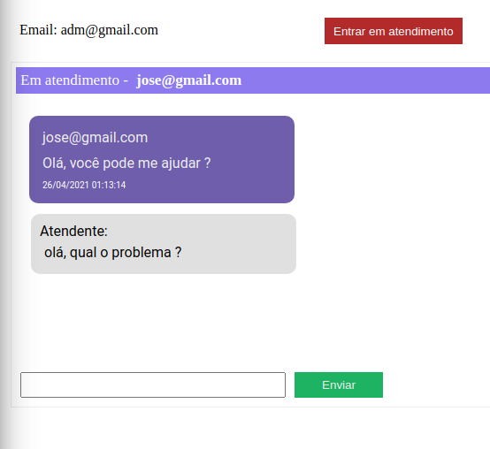
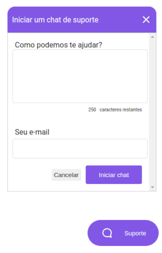
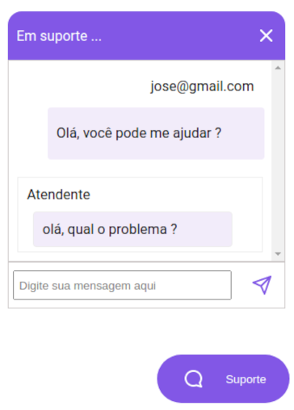
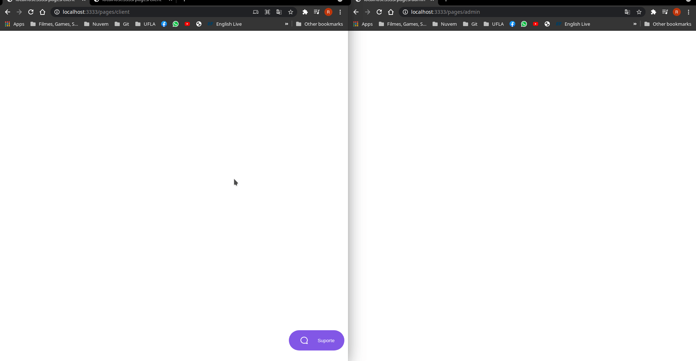

<h1 align="center">
    
    <br/>
    Support Chat
    <h4 align="center"> 
	NextLevelWeek 5.0 🚀
</h4>

</h1>

<p align="center">

 
  


  <a href="https://github.com/tgmarinho/nlw1/commits/master">
    
  </a>


   <a href="https://github.com/tgmarinho/nlw1/stargazers">
    
  </a>
   <a href="https://github.com/tgmarinho/nlw1/stargazers">
    
  </a>
</p>
<p align="center">

  
  -typescript-blue">

  

</p>


## Sobre o projeto

Support-chat - é um sistema de chat para suporte de um site. Nele é possível ser um administrador ou um cliente que solicita ajuda.

Os usuários encontrarão as seguintes funcionalidades:
- Iniciar um chat com administrador(Funcionário)
- Enviar mensagens para administrador(Funcionário)
- Responder mensagens do cliente
- Receber mensagens do cliente
- Visualizar histórico das mensagens

Projeto desenvolvido para aplicar estudos do [Nodejs][nodejs] utilizando  [Typescript][typescript] na semana NextLevelWeek 5 🚀

## Layout
<p align="center" style="display: flex; align-items: flex-start; justify-content: center;">
   <br>

  
  
</p>

## Demo

<p align="center" style="display: flex; align-items: flex-start; justify-content: center;">


  
</p>

## Tecnologias

As seguintes ferramentas foram usadas na construção do projeto:


- [Node][nodejs]
- [Socket.io][socketio]
- [Mustache][mustache]
- [Express][express]
- [Sqlite][sqlite]


## Como executar o projeto

### Pré-requisitos

Antes de começar, você vai precisar ter instalado em sua máquina as seguintes ferramentas:
[Git](https://git-scm.com), [Node.js][nodejs], [Yarn][yarn]
Além disto é bom ter um editor para trabalhar com o código como [VSCode][vscode] 

### Banco de dados

O banco de dados utilizado é o Sqlite 
Antes de iniciar a aplicação lembre-se de executar as migrations com:

```bash
yarn typeorm migration:run
```

### Rodando o Backend (Servidor)

```bash
# Clone este repositório
$ git clone https://github.com/rafaelabc/support-chat

# Acesse a pasta do projeto no terminal/cmd
$ cd support-chat

# Inicie a aplicação
$ yarn dev
# A aplicação será aberta na porta:3333
```
Rota para acessar página de cliente
* localhost:3333/pages/client

Rota para acessar página de administrador
* localhost:3333/pages/client

## 📝 Licença

Este projeto esta sobe a licença MIT.

Feito por Rafaela Custódio 👋🏽 [Entre em contato!](https://www.linkedin.com/in/rafaela-custodio/)

[yarn]: https://yarnpkg.com/
[vscode]: https://code.visualstudio.com/
[license]: https://opensource.org/licenses/MIT
[socketio]: https://socket.io/
[nodejs]: https://nodejs.org/en/
[typescript]: https://www.typescriptlang.org/
[express]: https://expressjs.com/pt-br/
[mustache]: https://github.com/janl/mustache.js
[sqlite]: https://www.sqlite.org/index.html
